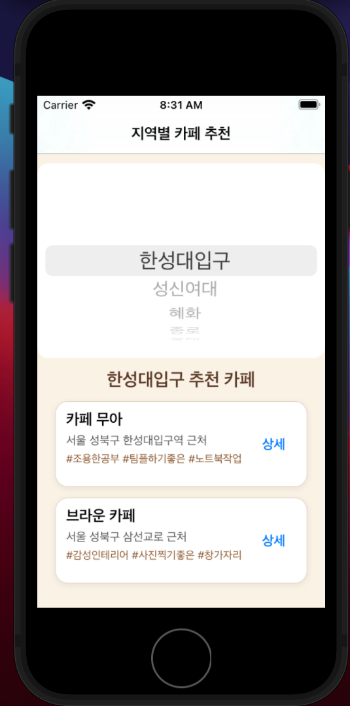
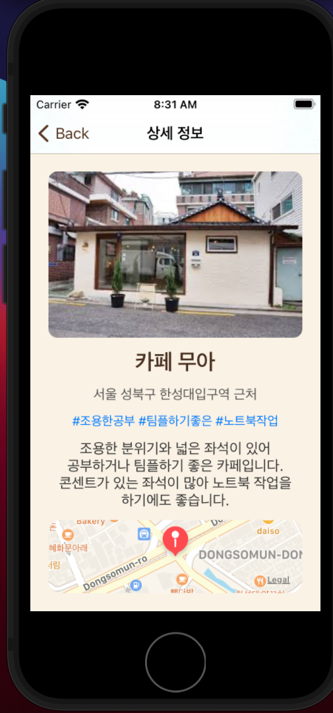

# 지역별 카페 추천 앱

## 프로젝트 소개

지역별 카페 추천 앱은 사용자가 원하는 지역을 선택하면 해당 지역의 추천 카페 목록을 보여주고, 선택한 카페의 상세 정보와 지도 위치를 확인할 수 있는 iOS 앱입니다.

사용자는 지역을 선택한 뒤 카페 이름, 주소, 키워드를 확인할 수 있으며, 상세 버튼을 눌러 카페 이미지, 설명, 위치 정보를 확인할 수 있습니다.

현재 카페 데이터는 실제 서비스 데이터가 아닌 앱 기능 구현을 위한 샘플 데이터로 구성하였고, 이미지는 기본 카페 이미지를 공통으로 사용했습니다.

---

## 앱 실행 화면

<p align="center">
  
  
</p>

---

## 메인 화면

메인 화면에서는 사용자가 지역을 선택할 수 있습니다.
지역을 선택하면 해당 지역에 맞는 추천 카페 목록이 표시됩니다.

각 카페 항목에는 다음 정보가 표시됩니다.

* 카페 이름
* 주소
* 카페 특징 키워드
* 상세 정보 버튼

---

## 상세 화면

상세 버튼을 누르면 상세 정보 화면으로 이동합니다.
상세 화면에서는 선택한 카페의 이미지, 이름, 주소, 키워드, 설명, 지도 위치를 확인할 수 있습니다.

MapKit을 사용하여 카페 위치를 지도에 표시하였고, Navigation Controller를 통해 뒤로가기 기능을 제공했습니다.

---

## 주요 기능

* 지역 선택 기능
* 선택한 지역의 카페 목록 표시
* 카페별 키워드 표시
* 상세 정보 화면 이동
* 카페 이미지, 주소, 설명 표시
* MapKit을 이용한 지도 위치 표시
* Navigation Controller를 이용한 뒤로가기 기능

---

## 사용 기술

* Swift
* UIKit
* UIStackView
* UIPickerView
* MapKit
* JSON
* Assets.xcassets

---

## 데이터 구성

카페 데이터는 앱 내부의 `cafeData.json` 파일로 관리했습니다.

각 카페 데이터는 다음 정보를 포함합니다.

* 카페 이름
* 지역
* 주소
* 설명
* 위도
* 경도
* 이미지 이름
* 키워드

예시 데이터 구조는 다음과 같습니다.

```json
{
  "name": "카페 무아",
  "region": "한성대입구",
  "address": "서울 성북구 한성대입구역 근처",
  "description": "조용한 분위기와 넓은 좌석이 있어 공부하거나 팀플하기 좋은 카페입니다.",
  "latitude": 37.5884,
  "longitude": 127.0062,
  "imageName": "cafe_default",
  "keywords": ["조용한공부", "팀플하기좋은", "노트북작업"]
}
```

---

## 화면 구성

### 메인 화면

메인 화면은 `UIStackView`를 중심으로 구성했습니다.

구성 요소는 다음과 같습니다.

* 앱 제목 Label
* 지역 선택 Picker View
* 추천 카페 목록 제목 Label
* 카페 목록 Stack View

지역을 선택하면 해당 지역의 카페만 필터링되어 목록에 표시됩니다.

### 상세 화면

상세 화면도 `UIStackView`를 중심으로 구성했습니다.

구성 요소는 다음과 같습니다.

* 카페 이미지 Image View
* 카페 이름 Label
* 주소 Label
* 키워드 Label
* 설명 Label
* 지도 Map View

선택한 카페 데이터는 메인 화면에서 상세 화면으로 전달되며, 전달된 데이터를 이용해 상세 정보를 표시합니다.

---

## 앱 특징

카페마다 키워드를 표시하여 사용자가 카페의 특징을 빠르게 파악할 수 있도록 구성했습니다.

사용한 키워드 예시는 다음과 같습니다.

* 조용한공부
* 팀플하기좋은
* 노트북작업
* 감성인테리어
* 사진찍기좋은
* 창가자리
* 디저트맛집
* 넓은좌석
* 음료다양

---

## 프로젝트 구조

```text
Cafe
├── Cafe.xcodeproj
└── Cafe
    ├── ViewController.swift
    ├── DetailViewController.swift
    ├── Cafe.swift
    ├── cafeData.json
    ├── Main.storyboard
    └── Assets.xcassets
```

---

## 구현 내용

### 1. JSON 데이터 불러오기

앱 내부의 `cafeData.json` 파일을 읽어와 `Cafe` 구조체 배열로 변환했습니다.

```swift
let data = try Data(contentsOf: url)
cafes = try JSONDecoder().decode([Cafe].self, from: data)
```

### 2. 지역별 카페 목록 표시

사용자가 Picker View에서 지역을 선택하면 해당 지역의 카페만 필터링하여 목록에 표시했습니다.

```swift
let filteredCafes = cafes.filter { $0.region == selectedRegion }
```

### 3. 상세 화면 데이터 전달

카페 목록에서 상세 버튼을 누르면 선택한 카페 정보를 `DetailViewController`로 전달했습니다.

```swift
detailVC.cafe = selectedCafe
```

### 4. 지도 위치 표시

상세 화면에서는 MapKit을 사용하여 선택한 카페의 위도와 경도를 기반으로 지도에 위치를 표시했습니다.

```swift
let coordinate = CLLocationCoordinate2D(
    latitude: cafe.latitude,
    longitude: cafe.longitude
)
```

---

## 시연 영상

<p align="center">
  <a href="https://youtu.be/yDB8tKTZEN4">
    
  </a>
</p>
YouTube 시연 영상 링크: https://youtu.be/yDB8tKTZEN4

---

## 개발자

1991302 오형채
